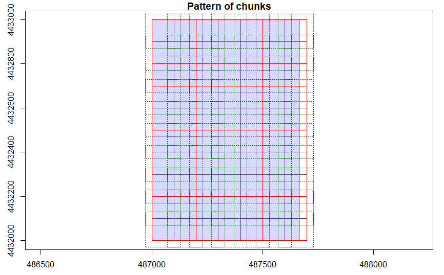
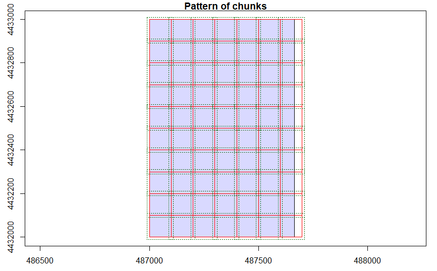
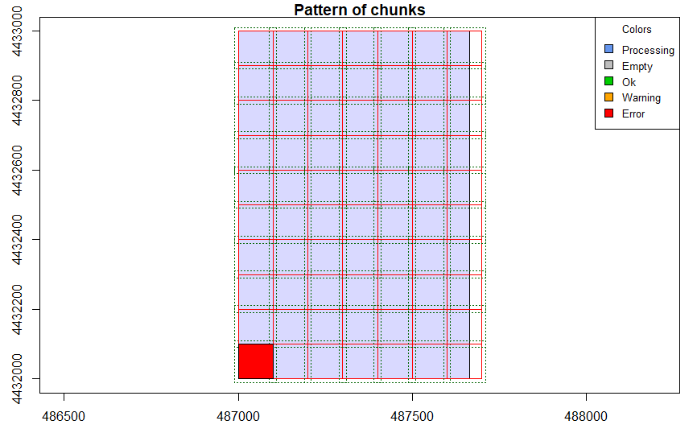
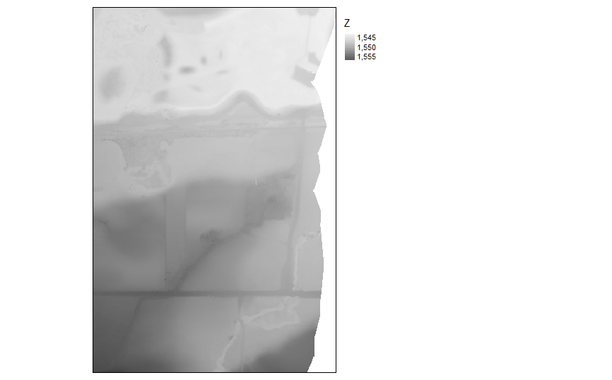
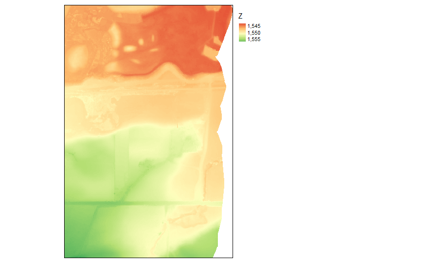
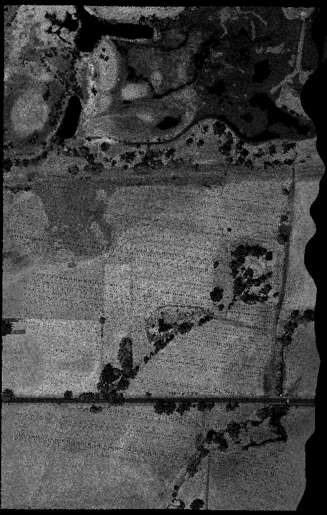

# Lidar-Point-Cloud-in-R
LiDAR and Image Processing in R

---
title: "LiDAR and Image Processing in R"
output: html_notebook
---

# Free LiDAR Data Sources
## Source: https://gisgeography.com/top-6-free-lidar-data-sources/

## 1. Open Topography
## 2. USGS Earth Explorer
## 3. United States Inter-agency Elevation Inventory
## 4. NOAA Digital Coast
## 5. National Ecological Observatory Network (NEON)
## 6. LIDAR Data Online

## Data used in this study: Earthdatascience: National Ecological Observatory Network (NEON)

## Visualize Lidar data (.las) with 
```
https://plas.io/
```

## Install and Load package working with raster data
```{r}
library(raster)
library(rgdal)
library(tmap)
library("tmaptools")
library("lidR")
library("RStoolbox")
```
## Read LIDAR
```{r}
getwd()
lidar <- readLAScatalog("earthanalyticswk3/BLDR_sample_lidar_points/2013_BLDR_flood_2013100814_487000_4432000.laz")

summary(lidar)
```
```
class       : LAScatalog (v1.3 format 1)
extent      : 487000, 487664.2, 4432000, 4433000 (xmin, xmax, ymin, ymax)
coord. ref. : WGS 84 / UTM zone 13N 
area        : 0.66 km²
points      : 830.6thousand points
density     : 1.3 points/m²
num. files  : 1 
proc. opt.  : buffer: 30 | chunk: 0
input opt.  : select: * | filter: 
output opt. : in memory | w2w guaranteed | merging enabled
drivers     :
 - Raster : format = GTiff  NAflag = -999999  
 - LAS : no parameter
 - Spatial : overwrite = FALSE  
 - SimpleFeature : quiet = TRUE  
 - DataFrame : no parameter
```

```{r}
lascheck(lidar)
```

```
 Checking headers consistency
  - Checking file version consistency... ✓
  - Checking scale consistency... ✓
  - Checking offset consistency... ✓
  - Checking point type consistency... ✓
  - Checking VLR consistency... ✓
  - Checking CRS consistency... ✓
 Checking the headers
  - Checking scale factor validity... ✓
  - Checking Point Data Format ID validity... ✓
 Checking preprocessing already done 
  - Checking negative outliers... ✓
  - Checking normalization... no
 Checking the geometry
  - Checking overlapping tiles... ✓
  - Checking point indexation... no>
```

## Create a DTM
### Chunk size
```{r}
opt_chunk_size(lidar) <- 100
plot(lidar, chunk_pattern = TRUE)
```
<!-- -->

### Chunk buffer
```{r}
opt_chunk_buffer(lidar) <- 10
plot(lidar, chunk_pattern = TRUE)
```
<!-- -->


```{r}
summary(lidar)
```
```
class       : LAScatalog (v1.3 format 1)
extent      : 487000, 487664.2, 4432000, 4433000 (xmin, xmax, ymin, ymax)
coord. ref. : WGS 84 / UTM zone 13N 
area        : 0.66 km²
points      : 830.6thousand points
density     : 1.3 points/m²
num. files  : 1 
proc. opt.  : buffer: 10 | chunk: 100
input opt.  : select: * | filter: 
output opt. : in memory | w2w guaranteed | merging enabled
drivers     :
 - Raster : format = GTiff  NAflag = -999999  
 - LAS : no parameter
 - Spatial : overwrite = FALSE  
 - SimpleFeature : quiet = TRUE  
 - DataFrame : no parameter
```


### Create DTM
### Use K-Nearest Neighbor inverse distance weighting interpolation method with 10 neighbors and power of 2 
### 
```{r}
opt_output_files(lidar) <- "dtm_{XLEFT}_{YBOTTOM}"
dtm <- grid_terrain(lidar, res = 2, knnidw(k = 10, p = 2), keep_lowest = FALSE)
```
<!-- -->


```{r}
tm_shape(dtm)+
tm_raster(style= "cont", palette=get_brewer_pal("Greys", plot=FALSE))+
tm_layout(legend.outside = TRUE)

```
<!-- -->


```{r}
tm_shape(dtm)+
tm_raster(style= "cont", palette=get_brewer_pal("RdYlGn", plot=FALSE))+
tm_layout(legend.outside = TRUE)
```

## DTM Raster
<!-- -->

## Lidar plas.io
<!-- -->
